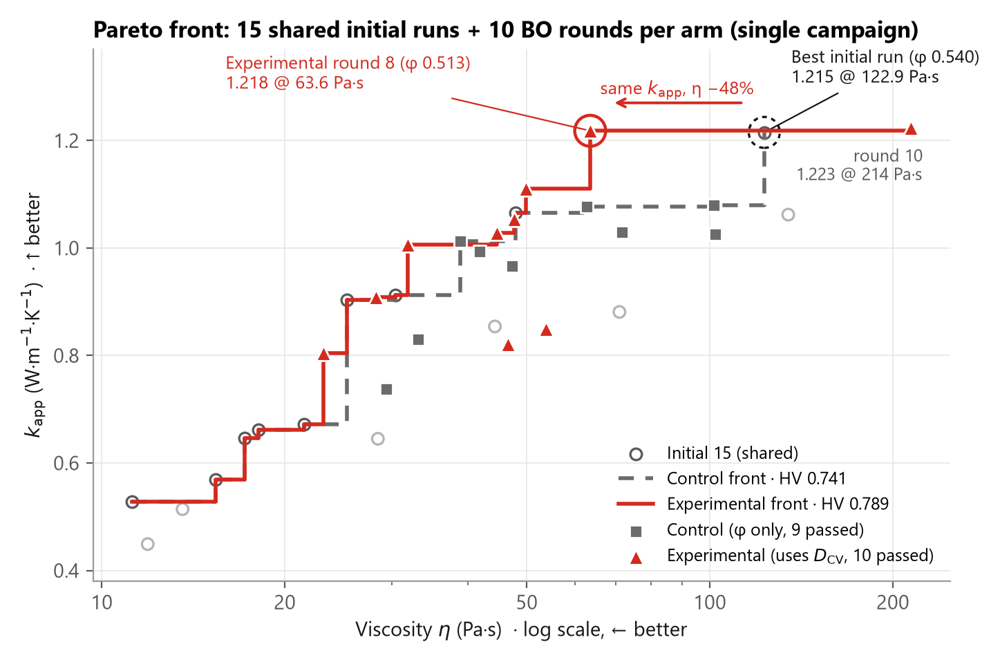

# formulation-bo

[English](README.md) · **한국어**

**더 적은 실험으로 더 좋은 소재 배합을 찾습니다.**

실험실 규모의 배합 문제를 위한 베이지안 최적화 라이브러리입니다. 시편을 수십 개씩 만들 여유가 없던 학부생이 만들었습니다.

복합 소재 배합을 격자 탐색으로 최적화하려면 시편이 수십 개 필요합니다. 하나하나에 재료와 장비 시간, 비용이 듭니다. 이 라이브러리는 지금까지 얻은 결과를 보고 다음에 만들 배합을 알려 줍니다.

실제 실험에도 사용했습니다. Al₂O₃/PDMS 배치 35개를 하나씩 배합하고 경화해서 측정했습니다. 두 군이 같은 초기 배치 15개에서 출발해 각각 10회씩 진행했습니다. 한 군은 필러 충전율만으로 탐색했고, 다른 군은 배치마다 측정한 분산도 지표도 함께 되먹였습니다.



| | 충전율만 사용 | + 분산도 피드백 |
|---|---:|---:|
| 10회 후 Pareto 초체적(HV) | 0.741 | **0.789** |
| 열전도도 예측오차, 교차검증 RMSE (W·m⁻¹·K⁻¹) | 0.142 | **0.052** (−63%) |
| 점도 예측오차, ln η의 교차검증 RMSE | 0.221 | **0.084** (−62%) |
| 배합 전 열전도도 예측오차, MAE (W·m⁻¹·K⁻¹) | 0.124 | **0.099** (−21%, p = 0.23) |

- **비슷한 열전도도를 절반 수준의 점도에서 얻었습니다.** 8회차 배치는 63.6 Pa·s에서 1.218 W·m⁻¹·K⁻¹였습니다. 초기 배치 중 가장 좋았던 것은 122.9 Pa·s에서 1.215였습니다.
- **이 저장소만으로 재현됩니다.** 실험 기록을 `FormulationOptimizer`에 다시 넣으면 실제로 배합한 충전율 20개가 그대로 나옵니다.
- **실험은 한 번이고 반복은 없습니다.** [이 결과가 말하는 것과 말하지 않는 것](#이-결과가-말하는-것과-말하지-않는-것)까지가 결과입니다.

[실제 실험 결과](#실제-실험-결과) · [작동 방식](#작동-방식) · [실행해 보기](#실행해-보기) · [내 문제에 쓰기](#내-문제에-쓰기)

그래프 안의 라벨은 영문입니다. Experimental은 실험군, Control은 대조군입니다.

---

## 어떤 문제를 푸는가

열 인터페이스 소재(TIM)를 최적화하고 있었습니다. PDMS 매트릭스에 알루미나 필러를 넣는 배합입니다. 두 목표가 서로 부딪힙니다. 필러 충전율을 높이면 열전도도는 좋아지지만, 점도가 올라가 결국 페이스트를 도포할 수 없게 됩니다.

학부생 셋이었고, 넓게 훑어볼 예산은 없었습니다.

그래서 전부 만들어 보는 대신, 지금까지 본 결과를 가우시안 프로세스로 모델링하고 정보가 가장 많은 다음 실험 하나를 고르게 했습니다.

## 작동 방식

1. **물리 기반 prior (선택).** 아무 정보 없이 시작하지 않고 대리모델을 물리 모델에 기대어 둘 수 있습니다. 유효 열전도도용 McLachlan GEM과 현탁액 점도용 Krieger-Dougherty가 예시로 들어 있습니다. 직접 만든 함수를 넣어도 되고, 빼면 평균이 0인 일반 GP로 동작합니다.
2. **가우시안 프로세스 대리모델.** prior와 실측값의 차이(잔차)를 학습합니다. 계층 구조가 필요하면 매개변수(mediator) 층을 추가할 수 있습니다.
3. **다목적 스칼라화.** ParEGO가 서로 부딪히는 목적함수 여러 개를 스칼라 하나로 합칩니다. 회차마다 가중치를 무작위로 뽑아 Pareto front를 차례로 훑습니다. 가중치를 직접 정하려면 `ask()`에 `lam=`을 넘기면 됩니다.
4. **Expected Improvement.** 불확실한 영역의 탐색과 유망한 영역의 활용 사이에서 균형을 잡아 다음 후보를 고릅니다.

<details>
<summary><b>수식</b></summary>

목적함수 $`y`$마다 prior $`p(x)`$에 GP 잔차 $`\delta`$를 더한 모델을 씁니다. `transform="log"`이면 $`\ln y`$에 같은 방식을 적용합니다. 매개변수 $`m`$은 시편을 만든 뒤에야 측정할 수 있는 값(여기서는 필러의 분산 상태)입니다. 그래서 따로 GP를 두고, 목적함수 모델에는 두 번째 입력으로 넣습니다.

```math
m \sim \mathrm{GP}(x), \qquad y(x, m) = p(x) + \delta(x, m)
```

매개변수는 미리 정할 수 없으므로 획득함수는 $`x`$만 탐색하고, 매개변수는 몬테카를로($`M = 200`$)로 적분합니다.

```math
m^{(i)} \sim \mathcal{N}\!\left(\mu_m(x), \sigma_m^2(x)\right), \qquad y^{(i)} \sim \mathcal{N}\!\left(\mu_y(x, m^{(i)}), \sigma_y^2(x, m^{(i)})\right)
```

모든 목적함수의 표본을 관측 범위로 정규화하고, 작을수록 좋은 방향으로 뒤집은 뒤($`\tilde f_j`$) 증강 체비셰프 스칼라화($`\rho = 0.05`$)로 합칩니다.

```math
g_\lambda = \max_j\left(\lambda_j \tilde f_j\right) + \rho \sum_j \lambda_j \tilde f_j
```

몬테카를로를 거친 예측분포는 정규분포가 아니므로, Expected Improvement는 폐형식 대신 표본 평균으로 구합니다. $`g_\mathrm{best}`$는 성공한 관측 중 가장 작은 $`g_\lambda`$이고 $`\xi = 0.01`$입니다. 후보 400개 중 EI가 가장 큰 것을 반환합니다.

```math
\mathrm{EI}(x) = \frac{1}{M}\sum_{i=1}^{M}\max\!\left(0,\ g_\mathrm{best} - g_\lambda^{(i)}(x) - \xi\right)
```

GP는 scikit-learn 구현이고, 커널은 Matérn 5/2에 입력별 길이 척도와 백색 잡음 항을 둡니다. 탐색에 쓰는 불확실성은 epistemic 성분뿐이며, 적합된 측정 잡음은 뺍니다. GP + EI 뼈대는 Na et al. (2025)을 따랐고, 스칼라화는 Knowles의 ParEGO입니다.

</details>

## 실제 실험 결과

소재는 이 라이브러리를 만들게 된 바로 그 소재입니다. PDMS에 구형 알루미나를 넣은 열 인터페이스 소재입니다. 목표는 겉보기 열전도도 k<sub>app</sub>를 높이고 점도 η를 낮추는 것이고, 설계 변수는 필러 부피분율 φ 하나입니다.

문제는 같은 φ로 만든 두 배치가 똑같이 나오지 않는다는 점입니다. 입자가 얼마나 고르게 분산되는지가 배치마다 다르고, 그 차이가 두 물성을 모두 움직입니다. 분산 상태는 미리 정할 수 없습니다. 배합해서 들여다본 뒤에야 알 수 있습니다.

그래서 배치를 광학현미경으로 촬영하고 이미지마다 숫자 하나, **D<sub>CV</sub>** 로 줄였습니다. 8 × 8 격자에서 구한 입자 면적분율의 변동계수이고, [dcv-vision](https://github.com/mthogeon0731/dcv-vision)으로 공개한 파이프라인으로 계산합니다. 값이 클수록 응집이 심합니다. 이 값이 최적화기의 `mediator`입니다.

### 실험 설정

초기 배치 15개는 두 군이 공유했습니다. 그 뒤 두 군이 각각 10회씩 진행했습니다.

| | 대조군 ■ (Control) | 실험군 ▲ (Experimental) |
|---|---|---|
| 라이브러리 모드 | `use_mediator=False` | `use_mediator=True` |
| 모델 | φ → (k<sub>app</sub>, η) | φ → D̂<sub>CV</sub> → (k<sub>app</sub>, η) |
| D<sub>CV</sub> | 사용하지 않음, 측정하지 않음 | 배합 전에는 예측값을 쓰고, 측정 후 실측값으로 다시 학습 |
| 배치 | 10개 (통과 9, 실패 1) | 10개 (모두 통과) |

나머지는 모두 같습니다. 초기 배치 15개(φ 0.31–0.54), GEM과 Krieger-Dougherty prior, 0.30–0.55 사이의 후보 φ 400개를 똑같이 썼습니다. 열전도도에 주는 ParEGO 가중치는 10회에 걸쳐 0.05에서 0.95로 올렸습니다. 그래서 탐색은 저점도 쪽에서 시작해 고열전도 쪽에서 끝납니다. 너무 되어서 도포할 수 없는 배치는 실패로 기록하고 k = 0으로 학습합니다. Na et al. (2025)의 방식입니다.

설정은 이것이 전부입니다.

```python
from formulation_bo import FormulationOptimizer, Objective, gem_tc, kd_viscosity

opt = FormulationOptimizer(
    bounds=(0.30, 0.55),
    objectives={
        "tc": Objective(direction="max", prior=gem_tc, fail_value=0.0),
        "eta": Objective(direction="min", prior=kd_viscosity, transform="log"),
    },
    x_max=0.64,          # prior의 최대 충전 한계
    use_mediator=True,   # 대조군은 False
)

opt.tell(0.445, {"tc": 0.904, "eta": 25.31}, mediator=0.416)  # 측정한 배치마다 한 번씩
# opt.tell(0.550, passed=False)                               # 만들 수 없었던 배치

opt.ask(lam=(0.05, 0.95))["recommended_x"]  # 초기 15개를 넣은 뒤: 0.4203, 실험실의 1회차
```

<details>
<summary><b>재료와 측정</b></summary>

| | |
|---|---|
| 매트릭스 | PDMS (Dow Sylgard 184, 베이스:경화제 = 10:1) |
| 필러 | 구형 α-Al₂O₃, D50 ≈ 20 μm, 단일 입도 |
| 시편 | 매 회차 새로 계량·혼합한 배치, 100 °C 경화, 두께 실측 0.98–1.13 mm |
| 열전도도 | 자작 지그(ASTM D5470 원리, 정상상태 1D 열유속법). ESP32와 MAX6675 열전대 리더 6개, 분해능 0.25 °C |
| k<sub>app</sub> | 접촉저항이 포함된 겉보기값입니다. 이 지그 안에서 배합의 순위를 비교하는 값이며 절대 열전도도가 아닙니다 |
| 점도 | η (Pa·s), 배치당 1값 |
| 분산도 | 광학현미경 이미지 → Otsu 이진화 → 8 × 8 격자 면적분율 → 변동계수. 초기 배치와 실험군만 측정했고 대조군은 측정하지 않았습니다 |
| 측정 범위 | φ 0.310–0.550 · k<sub>app</sub> 0.449–1.223 W·m⁻¹·K⁻¹ · η 11.2–214.2 Pa·s · D<sub>CV</sub> 0.269–0.723 |

실험은 같은 최적화 코어로 만든 iOS 앱으로 운용했습니다. 원자료는 [`tim_vlab_results.csv`](docs/results/data/tim_vlab_results.csv)이고, `tc` 열이 k<sub>app</sub>입니다.

</details>

### 1. 더 넓은 Pareto front를 찾았습니다


초체적(HV)은 두 축을 정규화했을 때 전선이 지배하는 면적입니다. 클수록 좋습니다.

| Pareto 초체적 | 실험군 | 대조군 |
|---|---:|---:|
| 공통 초기 15개만 | 0.733 | 0.733 |
| 7회차까지 | 0.741 | 0.738 |
| **10회차까지** | **0.789** | **0.741** |
| 실험군 8회차 제외 | 0.758 | 0.741 |

두 군은 7회차까지 비슷하게 갔습니다. 그러다 실험군 배치 하나가 전선을 옮겼습니다. 이 한 점을 빼면 실험군 HV는 0.758로 내려가고, 이는 최종 격차의 65%에 해당합니다. 순서는 유지되지만 시편 하나에 크게 기대고 있습니다.

그 시편이 맨 위 그림에서 원으로 표시한 점입니다.

| | φ | k<sub>app</sub> (W·m⁻¹·K⁻¹) | η (Pa·s) | D<sub>CV</sub> |
|---|---:|---:|---:|---:|
| 실험군 8회차 | 0.513 | 1.218 | 63.6 | 0.502 |
| 초기 최고 배치 | 0.540 | 1.215 | 122.9 | 0.610 |
| 차이 | | +0.003 | **−48%** | |

두 시편은 φ가 다르고, 필러가 적으면 그것만으로 점도가 낮아집니다. Krieger-Dougherty 식은 0.540 → 0.513에서 −32%를 예상합니다. 나머지 차이가 어디서 오는지는 이 자료로 알 수 없습니다. 각 행은 시편 1개의 측정값입니다.

<details>
<summary>HV 정규화 방식에 따라 순위가 바뀌나요?</summary>

바뀌지 않습니다. 실험에서는 통과한 34개 배치의 범위에 8% 여백을 더해 각 축을 정규화했습니다. 여백을 바꾸거나 점도를 로그축으로 바꿔도 순서는 같습니다.

| 정규화 | 실험군 | 대조군 | 실험군 (8회차 제외) |
|---|---:|---:|---:|
| 여백 0% | 0.896 | 0.831 | 0.853 |
| 여백 4% | 0.838 | 0.782 | 0.801 |
| **여백 8% (사용값)** | **0.789** | **0.741** | **0.758** |
| 여백 15% | 0.721 | 0.682 | 0.696 |
| 여백 25% | 0.648 | 0.618 | 0.629 |
| 여백 8%, log η | 0.640 | 0.595 | 0.616 |

8회차가 아닌 다른 배치 하나를 빼면 실험군 HV는 0.783 이상, 대조군 HV는 0.738 이상으로 남습니다.

</details>

### 2. 충전율로 설명되지 않는 부분을 분산도가 설명합니다

D<sub>CV</sub>가 있는 배치 25개(초기 15, 실험군 10)로 k<sub>app</sub> 모델 두 개를 교차검증했습니다. 하나는 φ만 보고, 다른 하나는 실측 D<sub>CV</sub>도 함께 봅니다.


| 5-fold 교차검증, 분할 20가지 | φ만 | φ + 실측 D<sub>CV</sub> | 오차 감소 |
|---|---:|---:|---|
| k<sub>app</sub> RMSE (W·m⁻¹·K⁻¹) | 0.142 | **0.052** | 63.4 ± 7.1% (36–71%), 20개 분할 모두에서 감소 |
| ln η RMSE | 0.221 | **0.084** | 62.0 ± 7.2% (37–70%), 20개 분할 모두에서 감소 |
| k<sub>app</sub> R² | 0.60 | **0.94** | |

φ만 쓴 모델의 오차는 무작위가 아닙니다. 응집이 심한 배치일수록 과대예측하고, 가장 크게 빗나간 두 점이 가장 응집된 두 배치(D<sub>CV</sub> 0.71, 0.72)입니다.


모델 없이도 같은 것이 보입니다. φ 0.46–0.49 사이에 독립 배치 5개가 있습니다.

| φ | D<sub>CV</sub> | k<sub>app</sub> (W·m⁻¹·K⁻¹) | η (Pa·s) |
|---:|---:|---:|---:|
| 0.463 | 0.399 | 1.006 | 31.9 |
| 0.481 | 0.500 | 1.028 | 44.7 |
| 0.470 | 0.575 | 0.854 | 44.3 |
| 0.475 | 0.600 | 0.821 | 46.6 |
| 0.485 | 0.649 | 0.850 | 53.7 |

응집이 더 심한 3개 배치는 잘 분산된 2개 배치보다 평균 k<sub>app</sub>가 17% 낮고 η가 26% 높습니다. 충전율은 거의 같습니다(0.477 대 0.472).

D<sub>CV</sub>는 φ와 함께 커집니다(r = 0.68). 하지만 φ의 선형 효과를 빼고 나서도 두 물성과 함께 움직입니다. 부분상관은 k<sub>app</sub>와 −0.69, ln η와 +0.71입니다. 이것은 예측 정보에 관한 이야기이지 인과 관계에 관한 이야기가 아닙니다.

### 3. 배합 전에는 개선 폭이 더 작습니다

위 비교는 실측 D<sub>CV</sub>를 씁니다. 이 값은 배치를 만든 뒤에야 생깁니다. 최적화기가 다음 배치를 고를 때는 예측값 D̂<sub>CV</sub>로 판단해야 합니다.

이를 확인하려고 실험군 10개 회차를 각각 그 이전까지의 자료만으로 다시 예측했습니다.


| 시점과 입력 | MAE (W·m⁻¹·K⁻¹) | 실측이 ±2σ 안 |
|---|---:|---:|
| 배합 전, φ만 | 0.124 | 10개 중 6개 |
| 배합 전, φ + 예측 D̂<sub>CV</sub> | **0.099** | **10개 중 9개** |
| 측정 후, φ + 실측 D<sub>CV</sub> | 0.050 | |

오차가 21% 줄었고 불확실성 추정도 실측과 더 잘 맞습니다. 다만 10점에서 Wilcoxon 부호순위 검정의 p는 0.23입니다. 개선 경향이며 통계적으로 유의한 차이는 아닙니다.

오차가 가장 컸던 세 회차(5, 6, 10)는 D<sub>CV</sub>가 0.60–0.71로 높게 나온 회차입니다. 남은 오차의 상당 부분은 배합 전에는 어떤 모델도 알 수 없는 배치별 분산 편차에서 옵니다. 분산도를 측정하고 나면 오차는 다시 절반으로 줄어듭니다.

### 4. 물리 prior는 빗나갔고, GP가 그 차이를 메웠습니다


prior는 기준선일 뿐입니다. φ 0.54에서 GEM 모델은 1.63 W·m⁻¹·K⁻¹를 예상했고 실측은 1.215였습니다. GP는 그 차이만 학습하면 됩니다. 곡선은 라이브러리의 기본 파라미터로 그렸습니다.

### 5. 최적화기가 추천한 배합


가중치가 점도에서 열전도도로 옮겨가면서 추천 φ가 0.42–0.44에서 0.50–0.55로 올라갔습니다.

대조군은 8회차에 φ 0.550을 추천했습니다. 페이스트가 너무 되어서 도포할 수 없었고, 그 배치는 실패로 기록했습니다. 최적화기는 패널티를 학습하고 0.505, 0.476으로 물러났습니다. 실험군은 10회차에 φ 0.549까지 갔습니다. 이 배치는 만들 수 있었고 점도는 214 Pa·s였습니다.

### 이 결과가 말하는 것과 말하지 않는 것

| 주장 | 자료가 뒷받침하는 것 | 다음 검증 |
|---|---|---|
| 탐색 우위 (HV) | 실험은 한 번입니다. 실험군 HV가 더 높았고, 격차의 65%가 배치 하나에서 나왔습니다 | 독립 반복 실험, 8회차 조성 재제작 |
| 배합 전 예측 | n = 10에서 MAE 21% 감소, p = 0.23 | 실험 반복, 경화 전 페이스트의 D<sub>CV</sub> 측정 |
| 측정 후 예측 | 25개 배치 교차검증에서 오차 63% 감소. 분할 20가지는 같은 자료를 다르게 나눈 것이며 실험 20번이 아닙니다 | |
| 두 군 비교 | 두 군은 D<sub>CV</sub> 입력과 2단 구조가 함께 다릅니다. 요인 하나만 바꾼 ablation이 아니고, 대조군 배치는 촬영하지 않았습니다 | D<sub>CV</sub>를 섞은 대조 실험, 대조군 배치 촬영 |
| 측정값 | k<sub>app</sub>는 접촉저항이 포함된 값이라 이 지그 안에서만 비교할 수 있습니다. 반복 측정 오차와 기준 시료 교정은 아직 없습니다 | 반복 측정, 기준 시료 |
| D<sub>CV</sub> | 시편당 대표 시야 1개이고, 격자 크기는 사전에 고정했습니다 | 시편당 여러 시야, 격자 크기 민감도 |
| 인과 | D<sub>CV</sub>에 예측 정보가 있다는 것까지입니다. D<sub>CV</sub>가 물성을 결정한다는 것은 보이지 않았습니다 | 같은 φ에서 분산 상태만 일부러 바꾼 배치 |

### 재현 방법

이 섹션의 모든 수치와 그래프는 원자료와 이 라이브러리에서 나옵니다.

```bash
python docs/results/replay.py        # 실험 재생: ask()가 실험실에서 배합한 φ를 그대로 내놓는지 확인 (20개 중 20개)
python docs/results/analyze.py       # 위의 모든 수치를 다시 계산 (1–2분)
python docs/results/make_figures.py  # 위의 모든 그래프를 다시 그림
```

| 파일 | 내용 |
|---|---|
| [`tim_vlab_results.csv`](docs/results/data/tim_vlab_results.csv) | 기록된 그대로의 35개 배치: `arm, iteration, phi, passed, thickness_mm, eta, tc, d_cv` |
| [`summary_metrics.json`](docs/results/data/summary_metrics.json) | 이 섹션의 모든 수치 |
| [`cv_out_of_fold.csv`](docs/results/data/cv_out_of_fold.csv) | 2번 결과의 교차검증 예측 |
| [`prospective_predictions.csv`](docs/results/data/prospective_predictions.csv) | 3번 결과의 회차별 예측 |
| [`hypervolume_by_iteration.csv`](docs/results/data/hypervolume_by_iteration.csv) | 1번 결과의 회차별 초체적 |

## 실행해 보기

데모는 물리 모델로 만든 가상의 정답을 상대로 돌아갑니다. 실험 장비 없이 수렴 과정을 볼 수 있습니다.

```bash
git clone https://github.com/mthogeon0731/formulation-bo
cd formulation-bo
pip install -r requirements.txt
python demo.py
```

가상의 물리계(GEM + Krieger-Dougherty에 측정 잡음과 제작 실패를 더한 것)를 만들고, 균등 간격의 초기 관측 10개를 넣은 뒤 최적화를 15회 돌려 `demo_convergence.png`를 저장합니다.


## 테스트

```bash
python tests/test_optimizer.py
```

테스트 프레임워크가 필요 없습니다. 물리 정의역 계약(범위를 벗어난 입력은 조용히 잘라내지 않고 즉시 실패), 매개변수가 있을 때와 없을 때의 ask/tell 순환, 최소 관측 수 검증, 시드 재현성을 확인합니다.

## 내 문제에 쓰기

```python
from formulation_bo import FormulationOptimizer, Objective

opt = FormulationOptimizer(
    bounds=(0.30, 0.65),
    objectives={
        "conductivity": Objective(direction="max"),
        "viscosity": Objective(direction="min"),
    },
)

opt.tell(0.35, {"conductivity": 1.40, "viscosity": 60.0})
opt.tell(0.40, {"conductivity": 1.82, "viscosity": 95.0})
opt.tell(0.55, {"conductivity": 3.10, "viscosity": 410.0})

result = opt.ask()
print(result["recommended_x"])  # -> 다음에 시험해 볼 배합
```

`ask()`는 관측이 3개 이상 있어야 대리모델을 학습할 수 있습니다. 물리 prior는 목적함수마다 따로 넣을 수 있고, 목적함수 개수는 2개로 고정돼 있지 않습니다. prior와 매개변수, 실패한 배치를 함께 쓰는 예는 [실험 설정](#실험-설정)에 있습니다.

## 참고 사항과 한계

- **설계 변수는 스칼라 하나입니다.** 필러 부피분율 같은 연속 변수 하나를 탐색합니다. 다성분 심플렉스 배합 설계는 다루지 않습니다.
- **자료가 적은 상황을 위한 도구입니다.** 실험 비용이 크고 관측이 5–30개 정도인 영역을 대상으로 합니다. 시편을 수천 개 만들 수 있다면 맞지 않는 도구입니다.
- **물리적 한계에서는 크게 실패합니다.** Krieger-Dougherty prior는 최대 충전율 아래에서만 정의됩니다. 그 경계를 넘는 입력은 물리적으로 불가능하므로 조용히 잘라내지 않고 `PhysicalLimitError`를 던집니다. 알아챌 수 없는 잘못된 추천은 프로그램이 멈추는 것보다 나쁩니다.
- **한 번에 하나만 추천합니다.** 배치 추천은 아직 구현하지 않았습니다.

## 사용한 도구

Python, NumPy, scikit-learn, Matplotlib. Codex의 도움을 받아 작성했습니다. 저는 화학공학 전공이고 ML 과목을 정식으로 들은 적이 없습니다. 제 연구에 필요해서 만든 도구입니다.

## 참고문헌

1. M. A. Rahman, M. M. Rahman, A. Ashraf, *Sci. Rep.* **13**, 2787 (2023). doi:[10.1038/s41598-023-29270-z](https://doi.org/10.1038/s41598-023-29270-z)
2. C. Na et al., *Compos. Sci. Technol.* **272**, 111400 (2025). doi:[10.1016/j.compscitech.2025.111400](https://doi.org/10.1016/j.compscitech.2025.111400)
3. D. Khatamsaz, V. Attari, R. Arróyave, Microstructure-aware Bayesian materials design, *Acta Mater.* **303**, 121587 (2026). doi:[10.1016/j.actamat.2025.121587](https://doi.org/10.1016/j.actamat.2025.121587)
4. D. S. McLachlan, M. Blaszkiewicz, R. E. Newnham, *J. Am. Ceram. Soc.* **73**, 2187 (1990). doi:[10.1111/j.1151-2916.1990.tb07576.x](https://doi.org/10.1111/j.1151-2916.1990.tb07576.x)
5. I. M. Krieger, T. J. Dougherty, *Trans. Soc. Rheol.* **3**, 137 (1959). doi:[10.1122/1.548848](https://doi.org/10.1122/1.548848)
6. J. Knowles, ParEGO, *IEEE Trans. Evol. Comput.* **10**, 50 (2006). doi:[10.1109/TEVC.2005.851274](https://doi.org/10.1109/TEVC.2005.851274)
7. ASTM D5470-17(2024), Standard Test Method for Thermal Transmission Properties of Thermally Conductive Electrical Insulation Materials.

## 라이선스

MIT
