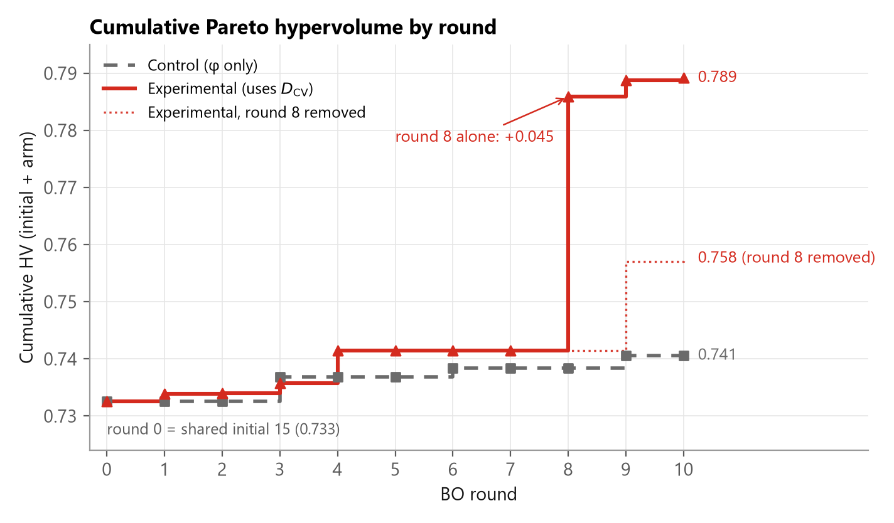
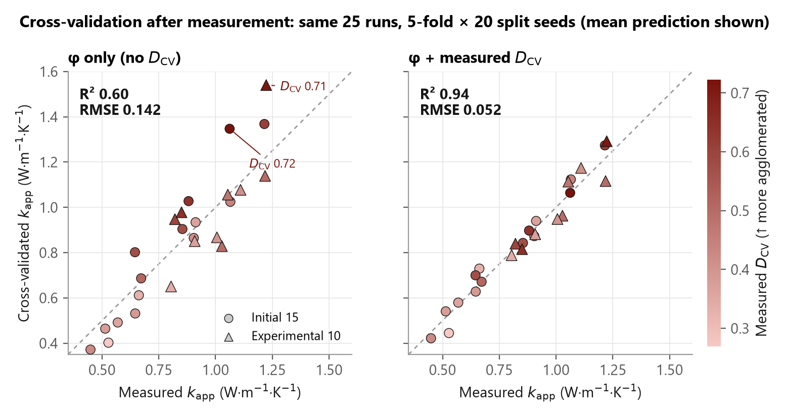
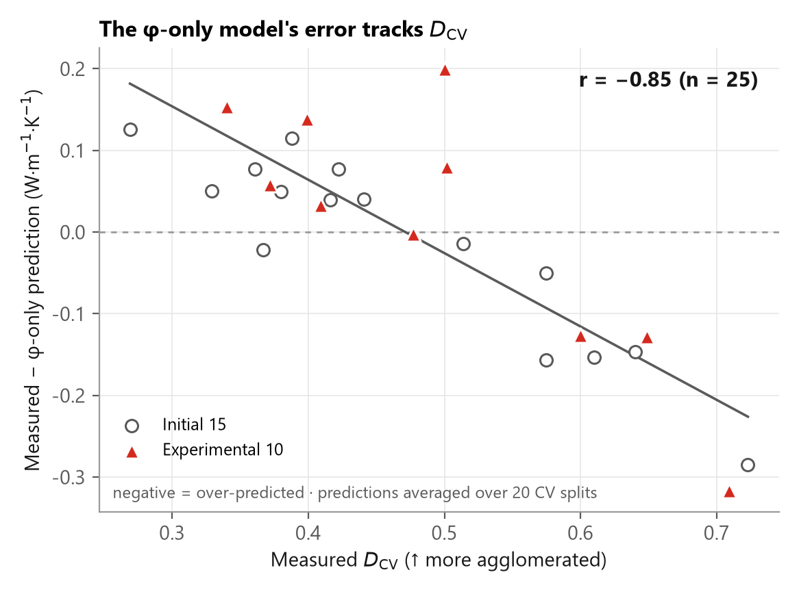
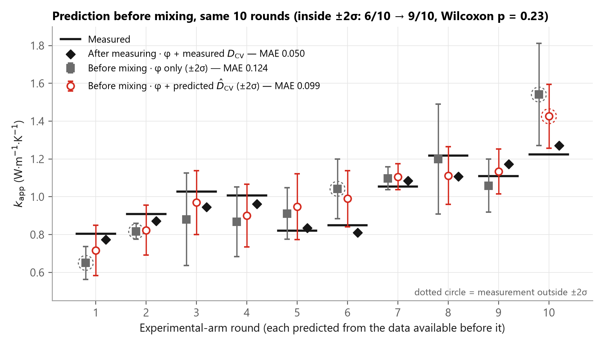
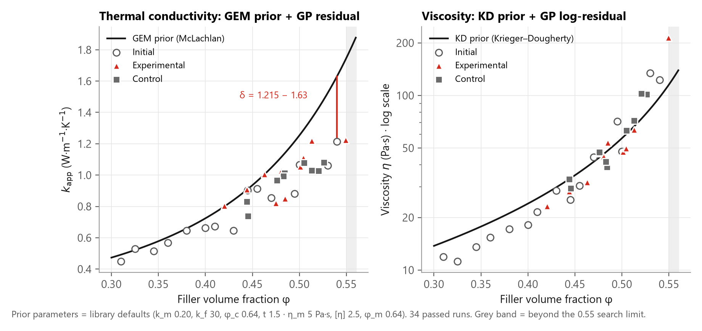
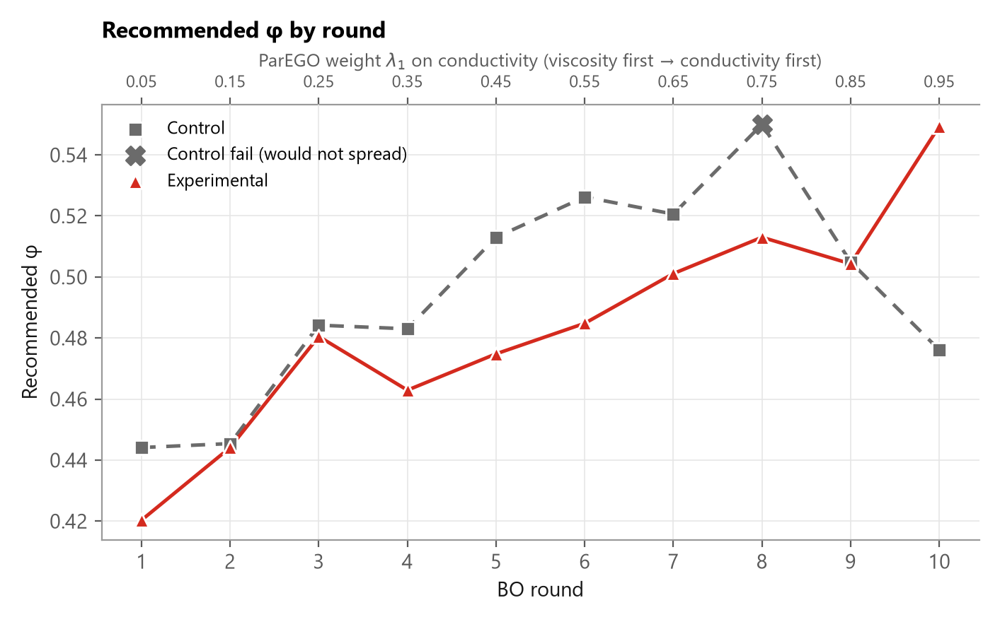

# formulation-bo

**English** · [한국어](README.ko.md)

**Find better material formulations in fewer experiments.**

A Bayesian optimization library for lab-scale formulation problems, built by an undergraduate who couldn't afford dozens of trial runs.

When you're optimizing a composite formulation, a grid search means dozens of samples. Each one costs material, equipment time, and money. This library looks at the results you already have and tells you which formulation to run next.

It has now been through a real lab campaign: 35 Al₂O₃/PDMS batches, each one mixed, cured and measured on the bench. Two arms started from the same 15 batches and ran 10 rounds each. One searched on filler fraction alone. The other also fed back a dispersion index measured from every batch.


| | Filler fraction only | + dispersion feedback |
|---|---:|---:|
| Pareto hypervolume after 10 rounds | 0.741 | **0.789** |
| Conductivity prediction error, cross-validated RMSE (W·m⁻¹·K⁻¹) | 0.142 | **0.052** (−63%) |
| Viscosity prediction error, cross-validated RMSE of ln η | 0.221 | **0.084** (−62%) |
| Conductivity prediction error before mixing, MAE (W·m⁻¹·K⁻¹) | 0.124 | **0.099** (−21%, p = 0.23) |

- **Same conductivity at about half the viscosity.** Round 8 reached 1.218 W·m⁻¹·K⁻¹ at 63.6 Pa·s. The best starting batch had 1.215 at 122.9 Pa·s.
- **Reproducible from this repo.** Replaying the lab log through `FormulationOptimizer` returns all 20 filler fractions that were actually mixed.
- **One campaign, no repeats.** [What it does and doesn't show](#what-this-does-and-doesnt-show) is part of the result.

[Results](#results-from-a-real-campaign) · [How it works](#how-it-works) · [Try it](#try-it) · [Use it on your own problem](#use-it-on-your-own-problem)

---

## The problem it solves

I was optimizing a thermal interface material: alumina filler in a PDMS matrix. Two objectives that fight each other — raise the filler fraction and thermal conductivity improves, but viscosity climbs until the paste won't dispense.

Three undergraduates. No budget for a wide sweep.

So instead of testing everything, the library models what it has seen with a Gaussian Process and picks the single most informative next experiment.

## How it works

1. **Optional physics-informed prior.** Rather than starting from zero, the surrogate can be anchored to a physical model — McLachlan GEM for effective conductivity, Krieger-Dougherty for suspension viscosity are included as examples. Supply your own, or omit it entirely and fall back to a standard zero-mean GP.
2. **Gaussian Process surrogate.** Fits the residual between the prior and observed measurements, with an optional mediator layer for hierarchical structure.
3. **Multi-objective scalarization.** ParEGO collapses any number of competing objectives into a single scalar with a randomized weight vector each round, tracing out the Pareto front over time. Pass `lam=` to `ask()` to set the weights yourself.
4. **Expected Improvement.** Chooses the next candidate by balancing exploration of uncertain regions against exploitation of promising ones.

<details>
<summary><b>The math</b></summary>

Each objective $`y`$ is modelled as a prior $`p(x)`$ plus a GP residual $`\delta`$. With `transform="log"` the same is done for $`\ln y`$. A mediator $`m`$ is something you can only measure after the sample exists (here, how well the filler dispersed), so it gets its own GP and enters the objective models as a second input:

```math
m \sim \mathrm{GP}(x), \qquad y(x, m) = p(x) + \delta(x, m)
```

The mediator can't be set in advance, so the acquisition searches over $`x`$ only and integrates the mediator out by Monte Carlo ($`M = 200`$):

```math
m^{(i)} \sim \mathcal{N}\!\left(\mu_m(x), \sigma_m^2(x)\right), \qquad y^{(i)} \sim \mathcal{N}\!\left(\mu_y(x, m^{(i)}), \sigma_y^2(x, m^{(i)})\right)
```

Samples of all objectives are normalized to the observed range, flipped so that smaller is better ($`\tilde f_j`$), and combined with the augmented Chebyshev scalarization ($`\rho = 0.05`$):

```math
g_\lambda = \max_j\left(\lambda_j \tilde f_j\right) + \rho \sum_j \lambda_j \tilde f_j
```

After the Monte Carlo step the predictive distribution is no longer Gaussian, so Expected Improvement is the sample mean instead of the closed form. $`g_\mathrm{best}`$ is the smallest $`g_\lambda`$ among the successful observations and $`\xi = 0.01`$. The candidate with the largest EI out of 400 is returned:

```math
\mathrm{EI}(x) = \frac{1}{M}\sum_{i=1}^{M}\max\!\left(0,\ g_\mathrm{best} - g_\lambda^{(i)}(x) - \xi\right)
```

The GP is scikit-learn's, with a Matérn 5/2 kernel, one length scale per input, and a white-noise term. The uncertainty that drives the search is the epistemic part only; fitted measurement noise is subtracted. The GP + EI skeleton follows Na et al. (2025), and the scalarization is Knowles' ParEGO.

</details>

## Results from a real campaign

The material is the one this library was written for: spherical alumina in PDMS, as a thermal interface material. The goals are a high apparent thermal conductivity k<sub>app</sub> and a low viscosity η. There is one design variable, the filler volume fraction φ.

The catch is that two batches made at the same φ don't come out the same. How evenly the particles disperse changes from batch to batch, and it moves both properties. Dispersion can't be dialled in. You only know it after you've mixed the batch and looked.

So the batches were photographed under an optical microscope and each image was reduced to one number, **D<sub>CV</sub>**: the coefficient of variation of the particle area fraction over an 8 × 8 grid, from the pipeline published as [dcv-vision](https://github.com/mthogeon0731/dcv-vision). Higher means more agglomerated. That number is the optimizer's `mediator`.

### Setup

Fifteen initial batches were shared. From there, two arms ran ten rounds each.

| | Control ■ | Experimental ▲ |
|---|---|---|
| Library mode | `use_mediator=False` | `use_mediator=True` |
| Model | φ → (k<sub>app</sub>, η) | φ → D̂<sub>CV</sub> → (k<sub>app</sub>, η) |
| D<sub>CV</sub> | not used, not measured | predicted before mixing, then retrained on the measured value |
| Batches | 10 (9 passed, 1 failed) | 10 (all passed) |

Everything else was identical: the same 15 initial batches (φ 0.31–0.54), GEM and Krieger-Dougherty priors, 400 candidate φ between 0.30 and 0.55, and a ParEGO weight on conductivity stepped from 0.05 to 0.95 over the ten rounds, so the search starts at the low-viscosity end and finishes at the high-conductivity end. A batch too thick to spread counts as failed and is learned as k = 0, the convention of Na et al. (2025).

This is the whole configuration:

```python
from formulation_bo import FormulationOptimizer, Objective, gem_tc, kd_viscosity

opt = FormulationOptimizer(
    bounds=(0.30, 0.55),
    objectives={
        "tc": Objective(direction="max", prior=gem_tc, fail_value=0.0),
        "eta": Objective(direction="min", prior=kd_viscosity, transform="log"),
    },
    x_max=0.64,          # packing limit of the priors
    use_mediator=True,   # False for the control arm
)

opt.tell(0.445, {"tc": 0.904, "eta": 25.31}, mediator=0.416)  # one call per measured batch
# opt.tell(0.550, passed=False)                               # a batch that couldn't be made

opt.ask(lam=(0.05, 0.95))["recommended_x"]  # after the 15 initial batches: 0.4203, round 1 in the lab
```

<details>
<summary><b>Materials and measurement</b></summary>

| | |
|---|---|
| Matrix | PDMS (Dow Sylgard 184, base to curing agent 10:1) |
| Filler | spherical α-Al₂O₃, D50 ≈ 20 μm, single size |
| Samples | a freshly weighed and mixed batch every round, cured at 100 °C, measured thickness 0.98–1.13 mm |
| Thermal conductivity | home-built steady-state 1D heat-flux rig on the ASTM D5470 principle (ESP32 with six MAX6675 thermocouple readers, 0.25 °C resolution) |
| k<sub>app</sub> | an apparent value that includes contact resistance. It ranks formulations on this rig; it is not an absolute conductivity |
| Viscosity | η in Pa·s, one value per batch |
| Dispersion | optical micrograph → Otsu threshold → area fraction on an 8 × 8 grid → coefficient of variation. Measured for the initial and experimental batches, not for the control arm |
| Ranges covered | φ 0.310–0.550 · k<sub>app</sub> 0.449–1.223 W·m⁻¹·K⁻¹ · η 11.2–214.2 Pa·s · D<sub>CV</sub> 0.269–0.723 |

The campaign was run through an iOS app built on the same optimizer core. The raw log is [`tim_vlab_results.csv`](docs/results/data/tim_vlab_results.csv), where `tc` is k<sub>app</sub>.

</details>

### 1. The search found a wider Pareto front



Hypervolume (HV) is the area the front dominates once both axes are normalized, so larger is better.

| Pareto hypervolume | Experimental | Control |
|---|---:|---:|
| Shared initial 15 only | 0.733 | 0.733 |
| After round 7 | 0.741 | 0.738 |
| **After round 10** | **0.789** | **0.741** |
| Without experimental round 8 | 0.758 | 0.741 |

The arms tracked each other for seven rounds. Then one experimental batch moved the front. Removing that single point drops the experimental HV to 0.758, which is 65% of the final gap. The order survives, but it rests heavily on one sample.

That sample is the one circled in the figure at the top:

| | φ | k<sub>app</sub> (W·m⁻¹·K⁻¹) | η (Pa·s) | D<sub>CV</sub> |
|---|---:|---:|---:|---:|
| Experimental round 8 | 0.513 | 1.218 | 63.6 | 0.502 |
| Best initial batch | 0.540 | 1.215 | 122.9 | 0.610 |
| Difference | | +0.003 | **−48%** | |

The two differ in φ, and less filler alone means lower viscosity: Krieger-Dougherty expects −32% for 0.540 → 0.513. This data can't say where the rest comes from. Each row is a single specimen.

<details>
<summary>Does the ranking depend on how HV is normalized?</summary>

No. The campaign normalized each axis to the range of the 34 passed batches plus an 8% margin. Other margins, and a log viscosity axis, give the same order.

| Normalization | Experimental | Control | Experimental without round 8 |
|---|---:|---:|---:|
| margin 0% | 0.896 | 0.831 | 0.853 |
| margin 4% | 0.838 | 0.782 | 0.801 |
| **margin 8% (used)** | **0.789** | **0.741** | **0.758** |
| margin 15% | 0.721 | 0.682 | 0.696 |
| margin 25% | 0.648 | 0.618 | 0.629 |
| margin 8%, log η | 0.640 | 0.595 | 0.616 |

Dropping any single batch other than round 8 leaves the experimental HV at 0.783 or above, and the control HV at 0.738 or above.

</details>

### 2. Dispersion explains what filler fraction can't

Take the 25 batches that have a D<sub>CV</sub> (15 initial, 10 experimental) and cross-validate two models of k<sub>app</sub>: one that sees only φ, and one that also sees the measured D<sub>CV</sub>.



| 5-fold CV, 20 different splits | φ only | φ + measured D<sub>CV</sub> | Error reduction |
|---|---:|---:|---|
| k<sub>app</sub> RMSE (W·m⁻¹·K⁻¹) | 0.142 | **0.052** | 63.4 ± 7.1% (36–71%), lower in 20 of 20 splits |
| ln η RMSE | 0.221 | **0.084** | 62.0 ± 7.2% (37–70%), lower in 20 of 20 splits |
| k<sub>app</sub> R² | 0.60 | **0.94** | |

The φ-only model doesn't miss at random. The more agglomerated a batch is, the more it over-predicts, and its two worst misses are the two most agglomerated batches (D<sub>CV</sub> 0.71 and 0.72).



You can see the same thing without any model. Five independent batches fall between φ 0.46 and 0.49:

| φ | D<sub>CV</sub> | k<sub>app</sub> (W·m⁻¹·K⁻¹) | η (Pa·s) |
|---:|---:|---:|---:|
| 0.463 | 0.399 | 1.006 | 31.9 |
| 0.481 | 0.500 | 1.028 | 44.7 |
| 0.470 | 0.575 | 0.854 | 44.3 |
| 0.475 | 0.600 | 0.821 | 46.6 |
| 0.485 | 0.649 | 0.850 | 53.7 |

The three more agglomerated batches average 17% lower k<sub>app</sub> and 26% higher η than the two better dispersed ones, at almost the same filler fraction (0.477 against 0.472).

D<sub>CV</sub> does rise with φ (r = 0.68). But with the linear effect of φ removed it still moves with both properties: partial r = −0.69 for k<sub>app</sub> and +0.71 for ln η. That is a statement about predictive information, not about cause.

### 3. Before mixing, the gain is smaller

The comparison above uses the measured D<sub>CV</sub>, which exists only after the batch does. When the optimizer picks the next batch it has to work from a predicted D̂<sub>CV</sub>.

To test that, each of the ten experimental rounds was predicted again using only the data that existed before it.



| When, and with what | MAE (W·m⁻¹·K⁻¹) | Measurement inside ±2σ |
|---|---:|---:|
| Before mixing, φ only | 0.124 | 6 of 10 |
| Before mixing, φ + predicted D̂<sub>CV</sub> | **0.099** | **9 of 10** |
| After measuring, φ + measured D<sub>CV</sub> | 0.050 | |

Error is 21% lower and the uncertainty is better calibrated. With ten points the Wilcoxon signed-rank p is 0.23, so this is a trend and not a significant difference.

The three worst rounds (5, 6 and 10) are the ones whose D<sub>CV</sub> turned out high, 0.60 to 0.71. A good part of the remaining error is batch-to-batch dispersion that no model can know before mixing. Once it is measured, the error halves again.

### 4. The physics prior was off, and the GP absorbed it



The priors are a baseline and nothing more. At φ 0.54 the GEM model expects 1.63 W·m⁻¹·K⁻¹ and the bench gave 1.215. The GP only has to learn that gap. The curves use the library's default parameters.

### 5. What the optimizer asked for



As the weight shifted from viscosity to conductivity, the recommendations climbed from φ 0.42–0.44 to 0.50–0.55.

In round 8 the control arm asked for φ 0.550. The paste was too thick to spread, so the batch was recorded as failed. The optimizer learned the penalty and backed off to 0.505 and then 0.476. The experimental arm reached φ 0.549 in round 10. That batch could be made, at 214 Pa·s.

### What this does and doesn't show

| Claim | What the data supports | What would settle it |
|---|---|---|
| Better search (HV) | One campaign. The experimental HV was higher, and 65% of the gap came from one batch | Independent repeat campaigns; remaking the round 8 formulation |
| Better prediction before mixing | MAE 21% lower at n = 10, p = 0.23 | More campaigns; measuring D<sub>CV</sub> on the uncured paste |
| Better prediction after measuring | 63% lower error in cross-validation on 25 batches. The 20 splits reshuffle one dataset. They are not 20 experiments | |
| Arm comparison | The arms differ in two things at once: the D<sub>CV</sub> input and the two-stage structure. This is not a single-factor ablation, and control batches weren't imaged | A shuffled-D<sub>CV</sub> control; imaging the control batches |
| Measurements | k<sub>app</sub> includes contact resistance and is only comparable within this rig. No repeat-measurement error or reference-sample calibration yet | Repeat measurements; a reference sample |
| D<sub>CV</sub> | One representative field of view per sample, and a grid size fixed in advance | Several fields per sample; grid-size sensitivity |
| Cause | D<sub>CV</sub> carries predictive information. Nothing here shows that it determines the properties | Batches at one φ with dispersion varied on purpose |

### Reproduce it

Every number and figure in this section comes from the raw log and this library.

```bash
python docs/results/replay.py        # replays the campaign: ask() must return the φ mixed in the lab, 20 of 20
python docs/results/analyze.py       # recomputes every number above (a minute or two)
python docs/results/make_figures.py  # redraws every figure above
```

| File | What it holds |
|---|---|
| [`tim_vlab_results.csv`](docs/results/data/tim_vlab_results.csv) | the 35 batches as logged: `arm, iteration, phi, passed, thickness_mm, eta, tc, d_cv` |
| [`summary_metrics.json`](docs/results/data/summary_metrics.json) | every number in this section |
| [`cv_out_of_fold.csv`](docs/results/data/cv_out_of_fold.csv) | cross-validated predictions behind section 2 |
| [`prospective_predictions.csv`](docs/results/data/prospective_predictions.csv) | round-by-round predictions behind section 3 |
| [`hypervolume_by_iteration.csv`](docs/results/data/hypervolume_by_iteration.csv) | hypervolume by round behind section 1 |

## Try it

The demo runs against a simulated ground truth built from the physical models, so you can watch it converge without any lab equipment.

```bash
git clone https://github.com/mthogeon0731/formulation-bo
cd formulation-bo
pip install -r requirements.txt
python demo.py
```

It generates a virtual physical system (GEM + Krieger-Dougherty, with measurement noise and fabrication failures), seeds 10 evenly-spaced initial observations, then runs 15 optimization rounds and writes `demo_convergence.png`.


## Tests

```bash
python tests/test_optimizer.py
```

No test framework required. Covers the physical domain contract (fail-fast on out-of-range input, never silently clamped), the ask/tell cycle both with and without a mediator variable, minimum-observation validation, and seed reproducibility.

## Use it on your own problem

```python
from formulation_bo import FormulationOptimizer, Objective

opt = FormulationOptimizer(
    bounds=(0.30, 0.65),
    objectives={
        "conductivity": Objective(direction="max"),
        "viscosity": Objective(direction="min"),
    },
)

opt.tell(0.35, {"conductivity": 1.40, "viscosity": 60.0})
opt.tell(0.40, {"conductivity": 1.82, "viscosity": 95.0})
opt.tell(0.55, {"conductivity": 3.10, "viscosity": 410.0})

result = opt.ask()
print(result["recommended_x"])  # -> the next formulation worth testing
```

`ask()` needs at least 3 observations before it can fit a surrogate. Physical priors are pluggable per objective, and the number of objectives isn't fixed at two. For priors, a mediator and failed batches together, see the [campaign configuration](#setup).

## Notes and limits

- **Single scalar design variable.** The optimizer searches over one continuous variable, such as filler volume fraction. Multi-component simplex blend design is out of scope.
- **Built for scarce data.** This targets the regime where experiments are expensive and you have roughly 5–30 observations. It's the wrong tool when you can afford thousands of samples.
- **Fails loudly at physical boundaries.** The Krieger-Dougherty prior is only defined below the maximum packing fraction. Inputs past that boundary are physically impossible, so the library raises `PhysicalLimitError` rather than silently clamping. A wrong recommendation you can't detect is worse than a crash.
- **One suggestion at a time.** Batch recommendation isn't implemented yet.

## Built with

Python, NumPy, scikit-learn, Matplotlib. Written with the help of Codex — I'm a chemical engineering major with no formal ML coursework, and this is the tool I needed for my own research.

## References

1. M. A. Rahman, M. M. Rahman, A. Ashraf, *Sci. Rep.* **13**, 2787 (2023). doi:[10.1038/s41598-023-29270-z](https://doi.org/10.1038/s41598-023-29270-z)
2. C. Na et al., *Compos. Sci. Technol.* **272**, 111400 (2025). doi:[10.1016/j.compscitech.2025.111400](https://doi.org/10.1016/j.compscitech.2025.111400)
3. D. Khatamsaz, V. Attari, R. Arróyave, Microstructure-aware Bayesian materials design, *Acta Mater.* **303**, 121587 (2026). doi:[10.1016/j.actamat.2025.121587](https://doi.org/10.1016/j.actamat.2025.121587)
4. D. S. McLachlan, M. Blaszkiewicz, R. E. Newnham, *J. Am. Ceram. Soc.* **73**, 2187 (1990). doi:[10.1111/j.1151-2916.1990.tb07576.x](https://doi.org/10.1111/j.1151-2916.1990.tb07576.x)
5. I. M. Krieger, T. J. Dougherty, *Trans. Soc. Rheol.* **3**, 137 (1959). doi:[10.1122/1.548848](https://doi.org/10.1122/1.548848)
6. J. Knowles, ParEGO, *IEEE Trans. Evol. Comput.* **10**, 50 (2006). doi:[10.1109/TEVC.2005.851274](https://doi.org/10.1109/TEVC.2005.851274)
7. ASTM D5470-17(2024), Standard Test Method for Thermal Transmission Properties of Thermally Conductive Electrical Insulation Materials.

## License

MIT
