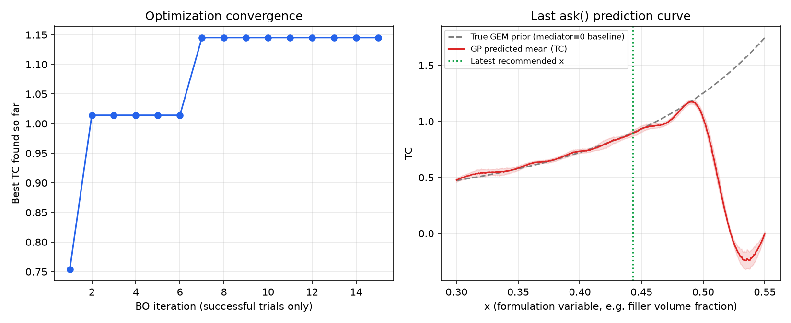

# formulation-bo

**Find better material formulations in fewer experiments.**

A Bayesian optimization library for lab-scale formulation problems, built by an undergraduate who couldn't afford dozens of trial runs.

When you're optimizing a composite formulation, a grid search means dozens of samples. Each one costs material, equipment time, and money. This library looks at the results you already have and tells you which formulation to run next.



---

## The problem it solves

I was optimizing a thermal interface material: alumina filler in a PDMS matrix. Two objectives that fight each other — raise the filler fraction and thermal conductivity improves, but viscosity climbs until the paste won't dispense.

Three undergraduates. No budget for a wide sweep.

So instead of testing everything, the library models what it has seen with a Gaussian Process and picks the single most informative next experiment.

## How it works

1. **Optional physics-informed prior.** Rather than starting from zero, the surrogate can be anchored to a physical model — McLachlan GEM for effective conductivity, Krieger-Dougherty for suspension viscosity are included as examples. Supply your own, or omit it entirely and fall back to a standard zero-mean GP.
2. **Gaussian Process surrogate.** Fits the residual between the prior and observed measurements, with an optional mediator layer for hierarchical structure.
3. **Multi-objective scalarization.** ParEGO collapses any number of competing objectives into a single scalar with a randomized weight vector each round, tracing out the Pareto front over time.
4. **Expected Improvement.** Chooses the next candidate by balancing exploration of uncertain regions against exploitation of promising ones.

## Try it

The demo runs against a simulated ground truth built from the physical models, so you can watch it converge without any lab equipment.

```bash
git clone https://github.com/mthogeon0731/formulation-bo
cd formulation-bo
pip install -r requirements.txt
python demo.py
```

It generates a virtual physical system (GEM + Krieger-Dougherty, with measurement noise and fabrication failures), seeds 10 evenly-spaced initial observations, then runs 15 optimization rounds and writes `demo_convergence.png`.

## Tests

```bash
python tests/test_optimizer.py
```

No test framework required. Covers the physical domain contract (fail-fast on out-of-range input, never silently clamped), the ask/tell cycle both with and without a mediator variable, minimum-observation validation, and seed reproducibility.

## Use it on your own problem

```python
from formulation_bo import FormulationOptimizer, Objective

opt = FormulationOptimizer(
    bounds=(0.30, 0.65),
    objectives={
        "conductivity": Objective(direction="max"),
        "viscosity": Objective(direction="min"),
    },
)

opt.tell(0.35, {"conductivity": 1.40, "viscosity": 60.0})
opt.tell(0.40, {"conductivity": 1.82, "viscosity": 95.0})
opt.tell(0.55, {"conductivity": 3.10, "viscosity": 410.0})

result = opt.ask()
print(result["recommended_x"])  # -> the next formulation worth testing
```

`ask()` needs at least 3 observations before it can fit a surrogate. Physical priors are pluggable per objective, and the number of objectives isn't fixed at two.

## Notes and limits

- **Single scalar design variable.** The optimizer searches over one continuous variable, such as filler volume fraction. Multi-component simplex blend design is out of scope.
- **Built for scarce data.** This targets the regime where experiments are expensive and you have roughly 5–30 observations. It's the wrong tool when you can afford thousands of samples.
- **Fails loudly at physical boundaries.** The Krieger-Dougherty prior is only defined below the maximum packing fraction. Inputs past that boundary are physically impossible, so the library raises `PhysicalLimitError` rather than silently clamping. A wrong recommendation you can't detect is worse than a crash.
- **One suggestion at a time.** Batch recommendation isn't implemented yet.

## Built with

Python, NumPy, scikit-learn, Matplotlib. Written with the help of Codex — I'm a chemical engineering major with no formal ML coursework, and this is the tool I needed for my own research.

## License

MIT
